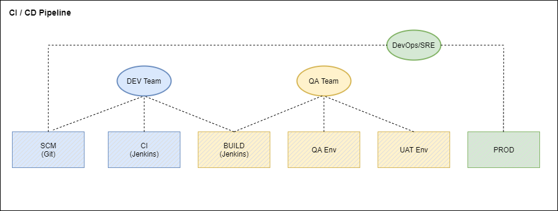
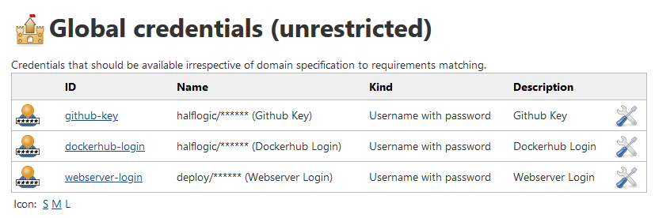
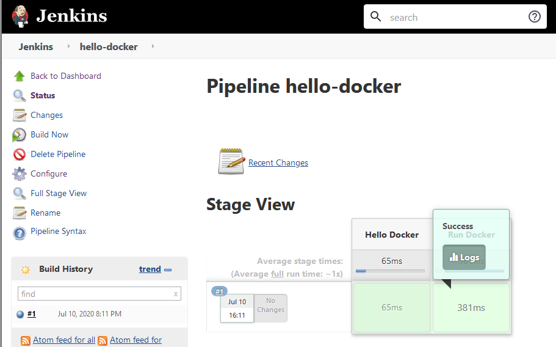

# Jenkins CI/CD Demo (AWS)

For an introduction on CI/CD, here's a great write up from Atlassian that you can read on:\
https://www.atlassian.com/continuous-delivery/principles/continuous-integration-vs-delivery-vs-deployment

## Overview

In this demo, we will be creating jobs in Jenkins that will handle application code build and deploying it to a Docker Container and Kubernetes cluster in AWS EKS. 

For creating the Kubernetes cluster, please refer to the AWS EKS Demo guide here:\
https://github.com/halflogic/aws-eks-demo

The diagram below is high-level overview of how CI/CD pipelines may be applied to an organization and the teams involved within process.



Here's a few details on the process involved during application code build and deployment. Infrastructure as Code (IaC) is also integrated in the build process that contains deployment configurations for the k8s pods.


## Create the Jenkins server

References: \
https://docs.aws.amazon.com/AmazonECS/latest/developerguide/docker-basics.html \
https://gist.github.com/npearce/6f3c7826c7499587f00957fee62f8ee9 \
https://www.jenkins.io/doc/book/installing \
https://github.com/jenkinsci/docker/blob/master/README.md

1. Create an ec2 instance with Amazon Linux 2, t3.small would be fine for this demo. You may need a larger instance once your demand increases.

2. Install and configure docker.

   ```
   # docker installation
   sudo yum update -y
   sudo amazon-linux-extras install docker -y
   sudo service docker start
   sudo usermod -a -G docker ec2-user
   sudo chkconfig docker on
   sudo yum install -y git
   # logout/restart
   ```

3. Setup Jenkins. For this step, Jenkins will be pulled from a [custom docker image](https://github.com/halflogic/jenkins-docker) that has all the requirements to run the build examples.\
   https://github.com/halflogic/jenkins-docker

   ```
   # run jenkins in detached mode
   docker container run -p 8080:8080 -p 50000:50000 \
    -v jenkins_home:/var/jenkins_home \
    -v /var/run/docker.sock:/var/run/docker.sock \
    --restart unless-stopped --detach \
    --name jenkins-docker halflogic/jenkins-docker

   # get the initialAdminPassword
   docker exec -it $(docker ps -aqf "name=jenkins-lts") cat /var/jenkins_home/secrets/initialAdminPassword
   ```

4. Grab the IP of the ec2 instance and open Jenkins in a browser: http://your-ec2-instance-ip:8080 \
   Go through the Jenkins setup wizard, install the recommended plugins and setup an admin user.

## Code Build and Deployment Requirements

1. Git Repository - Create a [GitHub](http://github.com) account
2. Container Image Registry - Create a [Dockerhub](https://hub.docker.com/) account 
3. Web Server - Create AWS EC2 Instance for Docker deployment example
4. Kubernetes Cluster - [Create AWS EKS for](https://github.com/halflogic/aws-eks-demo)  Kubernetes deployment example

## Create GitHub Token

1. Login to your GitHub account. \
   Go to Settings > Developer settings > Personal access tokens > Generate new token

2. Select the check boxes for the following scopes:
   - repo: (check all boxes)
   - admin:repo_hook (check all boxes)
   - user: user:email (check user:email box only)

3. Copy the generated token and save it in a secure way.

## Setup Credentials in Jenkins

1. Open Jenkins > Manage Jenkins > Manage Credentials

2. Under Stores scoped to Jenkins, click on (global)

3. Add all the required credentials for github, dockerhub, webserver.. etc.

   

## Create Pipeline Job

Reference:
https://www.jenkins.io/doc/book/pipeline/

Create a pipeline job to test if docker commands can be executed within Jenkins.

1. Jenkins > New Item > Enter an item name: hello-docker

2. Click Pipeline > click [ OK ]

3. In the Pipeline script text area, enter the code below and click [ Save ]
   ```
   pipeline {
       agent any
   
       stages {
           stage('Hello Docker') {
               steps {
                   echo 'Hello Docker'
               }
           }
           stage('Run Docker') {
               steps {
                   script {
                       sh '''
                       docker info
                       docker images
                       '''
                   }
               }
           }
       }
   }
   ```

4. Click [ Build Now ] \
   Once the build completes, click on the pipeline logs to inspect the output

   


## Pipeline Build using Jenkinsfile

Reference:
https://www.jenkins.io/doc/book/pipeline/jenkinsfile/

This example will use a Node.js app forked from [Linux Academy](https://linuxacademy.com/) 

Repository URL:
https://github.com/halflogic/cicd-pipeline-train-schedule-dockerdeploy

Jenkinsfile:
https://github.com/halflogic/cicd-pipeline-train-schedule-dockerdeploy/blob/master/Jenkinsfile


## Pipeline Build and Kubernetes Deployment

To do

